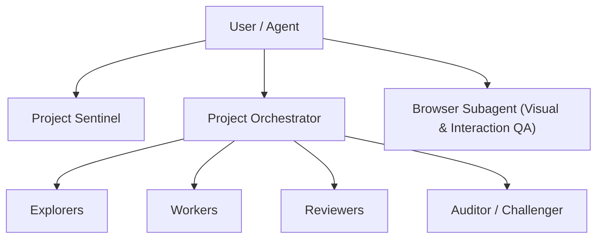

# Y'allternative Living — AI Agent Guidance & Operating Protocol (AGENTS.md)

This document provides project context, tech stack rules, data-flow pipelines, security constraints, and automated verification protocols for **all AI agents** (single-agent CLI sessions, IDE assistants like Cursor/Aider/Devin, and multi-agent teams) working in the **Y'allternative Living** repository.

---

## 1. Project Context & Brand Identity

- **Brand**: Y'allternative Living (Landrum, SC) — Queer-owned, Southern-raised, Alt-inspired small-batch handmade self-care, salves, soaks, body care, and apparel.
- **Voice**: Warm, funny, irreverent, proudly Southern & proudly queer. Goth meets Southern. Never mean or mocking.
- **Architecture**: 100% static HTML/CSS/JS with zero runtime framework dependencies. Fast, mobile-first, offline-capable via `sw.js`.
- **Integrations**: Stripe Checkout via a Cloudflare Worker (`workers/checkout.js`) + on-site cart (`assets/js/cart.js`), Formspree (contact & review submissions), Umami (cookieless analytics + conversion events), Kit/ConvertKit (newsletter), Tawk.to (live chat), Sveltia CMS (`/admin`).

---

## 2. Core Architectural Principles & Invariants

1. **Single Source of Truth (`assets/data/`)**:
   - Primary data sources: `assets/data/products.json`, `assets/data/events.json`, `assets/data/content.json`, `assets/data/site-reviews.json`.
   - **DO NOT** edit derived JS files (`assets/js/products-data.js`, `assets/js/events-data.js`, etc.) or product HTML files in `products/` directly. Edit the JSON source files in `assets/data/` and run `npm run build-data`.

2. **HTML Comment Markers**:
   - Dynamic copy uses HTML comment wrappers (e.g., `<!--YL:productCount-->13<!--/YL:productCount-->`).
   - Keep markers intact so `scripts/build-site-data.js` can replace inner text automatically.

3. **Security Headers Synchronization**:
   - Security headers and Content Security Policy (CSP) policies in `_headers`, `netlify.toml`, and `vercel.json` **must remain byte-identical**.
   - If CSP or security rules change, update via `npm run build-security-headers`.

4. **Self-Contained Integration Testing**:
   - `scripts/puppeteer_tests.js` automatically manages its own local HTTP static server lifecycle on port `8082`.
   - Never assume an external HTTP server is already running when triggering integration tests.

5. **One Lockfile (`package-lock.json`)**:
   - npm is this project's package manager -- the CI workflows, the docs and every `npm run ...` script assume it. `package-lock.json` is the only lockfile that may exist; do not add `pnpm-lock.yaml`, `yarn.lock` or `bun.lockb`.
   - Netlify chooses its package manager from whichever lockfile it finds and installs with `--frozen-lockfile`. A stale second lockfile silently becomes the one that decides production deploys: an out-of-date `pnpm-lock.yaml` broke every deploy for nine days while `npm test` stayed green.
   - After any change to `package.json`'s `dependencies`/`devDependencies`, run `npm install` so the lockfile follows. `npm test` asserts both invariants.

6. **No Superficial Fixes**:
   - Never comment out failing QA assertions, swallow errors silently, or use arbitrary dummy fallbacks to force a passing test.
   - The same rule applies to the CI workflows in `.github/workflows/`: a quality gate there must be allowed to fail the run. Never append `|| true` (or an equivalent) to a test step to keep a deploy green.

---

## 3. Maintenance Scripts & Verification Pipeline

Every AI agent MUST execute and pass all quality gates before finalizing changes:

| Step | Command | Script Source | Purpose & Action |
| :---: | :--- | :--- | :--- |
| **1** | `npm run build-data` | `node scripts/build-site-data.js` | Compiles JSON files into derived JS data objects, updates static HTML comment markers, generates `products/*.html`, `sitemap.xml`, `robots.txt`, and `llms.txt`. |
| **2** | `npm run optimize-images` | `node scripts/optimize-images.js` | *(Optional when adding new images)* Generates responsive AVIF/WebP image variants via Sharp and updates `assets/js/image-manifest.js`. |
| **3** | `npm run build-security-headers` | `node scripts/build-security-headers.js` | Syncs CSP rules across `_headers`, `netlify.toml`, and `vercel.json`. |
| **4** | `npm run test` | `node scripts/run-unit-tests.js && node scripts/qa-check.js` | Runs every `scripts/*.test.js` unit suite (cart pricing, Worker checkout/tax/gift-card math, build-data compiler, main.js, social-feed sync, translator), then 330+ static quality assertions (JSON-LD validation, gift-card/bundle pricing, CSP coverage, FAQ match, rating calculations, comment traps). |
| **5** | `npm run lint` | `eslint scripts assets/js` | Enforces JavaScript quality and syntax standards. |
| **6** | `npm run format:check` | `prettier --check` | Validates formatting across scripts and client JS files. |
| **7** | `npm run test:integration` | `puppeteer_tests.js`, `extended_qa_test.js`, `security_stress_test.js`, `reveal-check.js`, `a11y-check.js` | Runs automated headless browser tests across Desktop (1200x800), **Tablet (768x1024)**, and Mobile (375x667) viewports (link integrity, menu drawer, form intercept, on-site cart add-to-cart flow, XSS/CSP stress), then the scroll-reveal gate and the axe-core accessibility gate. |
| **8** | `npm run test:cross-browser` | `cross-browser-check.js` | Runs the reveal and nav-underline behaviour on **Chromium, Firefox and WebKit** via Playwright, plus mobile Safari (iPhone 14) and mobile Chrome (Pixel 7) device profiles. Needs the engines: `npx playwright install --with-deps chromium firefox webkit`. |

> **What CI runs**: `.github/workflows/test.yml` has two jobs. `qa` is the fast one -- steps 5, 6 and 4 (`lint`, `format:check`, `npm test`) with browsers skipped, so cheap failures come back first. `browser` runs steps 7 and 8, installing Puppeteer's Chromium and the three Playwright engines (cached between runs, keyed on the lockfile). Both must pass. This was not always true: the browser suites used to be local-only, which is how a blank `about.html` reached production with a fully green board -- if you are tempted to drop the `browser` job to save Actions minutes, that is the failure you are re-enabling. Doc-only commits (`**.md`, `docs/**`) skip the workflow entirely.

> **Scroll-reveal gate**: `scripts/reveal-check.js` holds one rule -- content the browser has painted is never hidden afterwards, and content never waits on a script to become visible. `.reveal` used to carry `opacity:0` in CSS with only a 165KB deferred `main.js` able to undo it, so `about.html` (everything below its hero is `.reveal`, and nothing else is) rendered a headline over a blank expanse until that script landed. **Note why this gate spoofs `navigator.webdriver`**: `main.js` skips the IntersectionObserver entirely when it is true, so every other Puppeteer suite here exercises none of the reveal logic -- which is how the original bug shipped with a fully green board. The gate forces it false and fails the run if that spoof ever stops working, because these checks passing vacuously would be worse than not having them. It also asserts the entrance animation still plays, so "fixing" a hidden-content failure by deleting the animation fails too.

> **Cross-browser gate**: `scripts/cross-browser-check.js` runs the same behaviour on Chromium, Firefox and WebKit through Playwright, plus mobile Safari and mobile Chrome device profiles. Every other browser suite here drives Puppeteer, i.e. Chromium only -- a real blind spot for a site whose visitors are mostly on phones, where WebKit *is* the browser. It also re-runs each engine with the Paint Timing API stubbed out, standing in for a browser too old to report paints, because `main.js` feature-detects that and takes a different branch. A missing or unlaunchable engine **fails** the run rather than skipping quietly: a gate that silently covers one engine while claiming three is worse than no gate.

> **Accessibility gate**: `scripts/a11y-check.js` scans every top-level and generated product page with axe-core against `wcag2a`, `wcag2aa`, `wcag21a`, `wcag21aa`, `wcag22aa` and `best-practice`, and fails on **any** violation -- the site is currently at zero, and that is the bar to keep. Do not narrow that tag list to make a run pass: scanning `wcag2aa` alone is exactly how a serious WCAG 2.2 target-size failure sat unnoticed on all 19 product pages. `scripts/run_audit.js` is the richer hand-run report (screenshots, per-viewport overflow, transitions); the gate is the automated one.

---

## 4. Multi-Agent & Subagent System Architecture

When executing in a multi-agent mode (e.g. `/teamwork-preview` or `/browser`), agent roles and workflow boundaries are structured as follows:

- **Project Sentinel**: Tracks requirements, logs liveness, and manages audit trails in `.agents/`.
- **Project Orchestrator**: Decomposes milestones (R1, R2, R3) and coordinates subagents.
- **Explorers**: Read-only research, file inspection, link checking, and structural audit.
- **Workers**: Code modification, script fixes, and feature implementation.
- **Reviewers & Auditor**: Objective peer review of diffs against acceptance criteria.
- **Browser Auditor**: Puppeteer/Chrome automation testing across Desktop (1280x800), **Tablet (768x1024)**, and Mobile (375x812) viewports, verifying DOM interaction, grid reflow, and recording visual proof.
