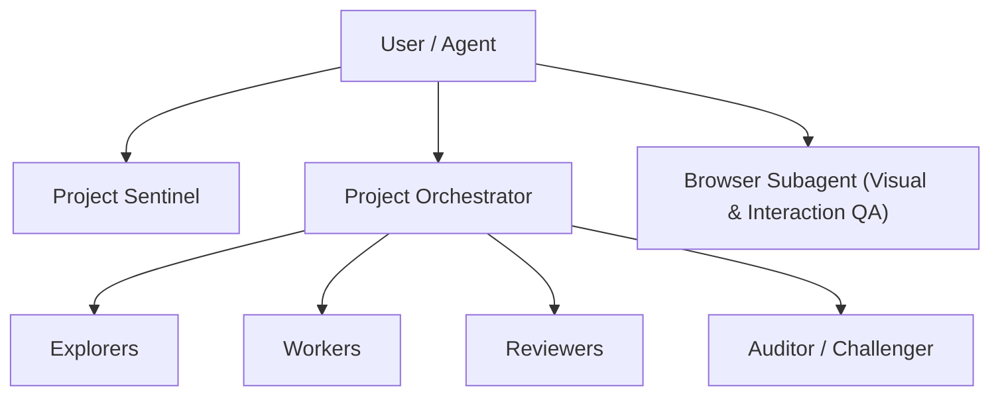

# Y'allternative Living — AI Agent Guidance & Operating Protocol (AGENTS.md)

This document provides project context, tech stack rules, data-flow pipelines, security constraints, and automated verification protocols for **all AI agents** (single-agent CLI sessions, IDE assistants like Cursor/Aider/Devin, and multi-agent teams) working in the **Y'allternative Living** repository.

---

## 1. Project Context & Brand Identity

- **Brand**: Y'allternative Living (Landrum, SC) — Queer-owned, Southern-raised, Alt-inspired small-batch handmade self-care, salves, soaks, body care, and apparel.
- **Voice**: Warm, funny, irreverent, proudly Southern & proudly queer. Goth meets Southern. Never mean or mocking.
- **Architecture**: 100% static HTML/CSS/JS with zero runtime framework dependencies. Fast, mobile-first, offline-capable via `sw.js`.
- **Integrations**: Stripe Checkout via a Cloudflare Worker (`workers/checkout.js`) + on-site cart (`assets/js/cart.js`), Formspree (contact & review submissions), Umami (cookieless analytics + conversion events), Kit/ConvertKit (newsletter), Tawk.to (live chat), Sveltia CMS (`/admin`).

---

## 2. Core Architectural Principles & Invariants

1. **Single Source of Truth (`assets/data/`)**:
   - Primary data sources: `assets/data/products.json`, `assets/data/events.json`, `assets/data/content.json`, `assets/data/site-reviews.json`.
   - **DO NOT** edit derived JS files (`assets/js/products-data.js`, `assets/js/events-data.js`, etc.) or product HTML files in `products/` directly. Edit the JSON source files in `assets/data/` and run `npm run build-data`.

2. **HTML Comment Markers**:
   - Dynamic copy uses HTML comment wrappers (e.g., `<!--YL:productCount-->13<!--/YL:productCount-->`).
   - Keep markers intact so `scripts/build-site-data.js` can replace inner text automatically.

3. **Security Headers Synchronization**:
   - Security headers and Content Security Policy (CSP) policies in `_headers`, `netlify.toml`, and `vercel.json` **must remain byte-identical**.
   - If CSP or security rules change, update via `npm run build-security-headers`.

4. **Self-Contained Integration Testing**:
   - `scripts/puppeteer_tests.js` automatically manages its own local HTTP static server lifecycle on port `8082`.
   - Never assume an external HTTP server is already running when triggering integration tests.

5. **One Lockfile (`package-lock.json`)**:
   - npm is this project's package manager -- the CI workflows, the docs and every `npm run ...` script assume it. `package-lock.json` is the only lockfile that may exist; do not add `pnpm-lock.yaml`, `yarn.lock` or `bun.lockb`.
   - Netlify chooses its package manager from whichever lockfile it finds and installs with `--frozen-lockfile`. A stale second lockfile silently becomes the one that decides production deploys: an out-of-date `pnpm-lock.yaml` broke every deploy for nine days while `npm test` stayed green.
   - After any change to `package.json`'s `dependencies`/`devDependencies`, run `npm install` so the lockfile follows. `npm test` asserts both invariants.

6. **No Superficial Fixes**:
   - Never comment out failing QA assertions, swallow errors silently, or use arbitrary dummy fallbacks to force a passing test.
   - The same rule applies to the CI workflows in `.github/workflows/`: a quality gate there must be allowed to fail the run. Never append `|| true` (or an equivalent) to a test step to keep a deploy green.

7. **Every commit that reaches `main` spends Netlify credits**:
   - Netlify meters this site in credits -- the dashboard's word -- and every build spends them; on 4 September 2026 the allowance was used up: nothing could deploy again until it was replenished, which the owner has since paid to do. The one mercy of the model is that Netlify keeps serving the last published deploy, so the live site stayed up while the pipeline was dead. Credits are spent by **builds**, not by merges -- a production build for every commit that reaches `main`, plus a deploy preview or branch deploy for every push to a branch Netlify is set to build in its UI. Each build runs `npm install --include=dev` (`NPM_FLAGS` in `netlify.toml`) -- and `puppeteer` and `playwright` are both in `devDependencies`, so until the skip switches below are in place that install downloads browsers too -- then `node scripts/optimize-images.js && node scripts/build-site-data.js && node scripts/build-security-headers.js`. Every push pays for the whole thing again.
   - **The volume is the problem, and it is countable.** 108 commits on `main` are dated 1 September 2026 or later (`git rev-list --count origin/main --since=2026-09-01`). 66 of them landed on 4 September alone, and those 66 are also every commit pushed anywhere in the repository that day (`git log --remotes --since="2026-09-04 00:00" --until="2026-09-05 00:00" --format=%h | sort -u | wc -l`), from the two remote branches whose tips carry that date (`git for-each-ref refs/remotes/origin --format='%(refname:short) %(committerdate:short)' | grep 2026-09-04 | wc -l`). Five of the 66 are merges; of the 61 that carry files, 15 touch only `.github/`, `docs/`, `workers/`, `*.md` or `scripts/*.test.js` -- nothing the site serves. Those numbers are **commits and pushes**. How many of them became builds is in the Netlify dashboard, which this repository cannot see, so never write a deploy count you got from `git`.
   - **Batch.** One merge per body of work, not one per commit; when two sessions are open, land both on one branch and merge once.
   - **Skip what does not ship.** `netlify.toml` carries a `[build] ignore` command: `git diff --quiet $CACHED_COMMIT_REF $COMMIT_REF -- . ':(exclude)docs' ':(exclude)workers' ':(exclude).github' ':(exclude)*.md' ':(exclude)scripts/*.test.js'`. git exits 0 when the diff since the last deployed commit touches only those paths, and Netlify cancels a build whose ignore command exits 0 -- no build, no credits. Anything else builds, including a missing `CACHED_COMMIT_REF` (first build, cleared cache), which is the safe default. The rule is generated by `scripts/build-security-headers.js`; change it there, never in the toml by hand. Excluding a path that IS served would make a real change silently never deploy, so the list holds only what is certainly not part of the deploy (the Worker is deployed by Cloudflare, docs and workflows are never served, `*.test.js` never runs on Netlify); when unsure, leave a path out of it and pay for the build.
   - `[skip netlify]` in a commit message skips Netlify's build for that push. Use it on PR-branch pushes whose preview nobody needs -- CI's `browser` job is the gate, not the preview. It does not skip GitHub Actions; `[skip ci]` would, so never use that one. **Keep it off any commit that will be merged into `main`.** Observed 2026-09-05: the merge commits `58fb2d0` and `e605ae9` carried no tag, every commit on the two branches they merged did, and neither push produced a deploy -- the live site's `sw.js` hash never moved off the build before them. Until Netlify's own deploy log says why, treat the tag as poisoning the whole push it travels in, and ship a deploy as a direct commit to `main`.
   - **A deploy is verified on the live site, never on GitHub.** `curl -sS https://yallternativeliving.com/sw.js | grep -m1 CACHE_NAME` must equal `git show origin/main:sw.js | grep -m1 CACHE_NAME`; `curl -sS https://yallternativeliving.com/assets/css/styles.css | grep -c "overflow-x: clip"` returning 1 is the same fact from a second file. GitHub reported both merges above as complete while shoppers were still being served the previous build; only this check noticed.
   - A build must never download a browser it will not open. Nothing in that build command drives Puppeteer or Playwright, so the generated `[build.environment]` block is where `PUPPETEER_SKIP_DOWNLOAD` and `PLAYWRIGHT_SKIP_BROWSER_DOWNLOAD` belong; check they are there before you go hunting for credits anywhere else.
   - **Every number in this file comes from a dashboard, an invoice, or a command whose output you quoted -- never from inference, and never from paraphrase either.** This bullet has now been wrong twice: the 4 September 2026 version priced a deploy at an invented "15 credits" against an invented "300-credit month" and totted up "990 credits"; the first correction threw those out but named the wrong unit, taking the owner's shorthand for what the dashboard meters. The dashboard says credits. What the allowance is, and what one build costs, are still to be read off that dashboard before either number is written here.

---

## 3. Maintenance Scripts & Verification Pipeline

Every AI agent MUST execute and pass all quality gates before finalizing changes:

| Step | Command | Script Source | Purpose & Action |
| :---: | :--- | :--- | :--- |
| **1** | `npm run build-data` | `node scripts/build-site-data.js` | Compiles JSON files into derived JS data objects, updates static HTML comment markers, generates `products/*.html`, `sitemap.xml`, `robots.txt`, and `llms.txt`. |
| **2** | `npm run optimize-images` | `node scripts/optimize-images.js` | *(Optional when adding new images)* Generates responsive AVIF/WebP image variants via Sharp and updates `assets/js/image-manifest.js`. |
| **3** | `npm run build-security-headers` | `node scripts/build-security-headers.js` | Syncs CSP rules across `_headers`, `netlify.toml`, and `vercel.json`. |
| **4** | `npm run test` | `node scripts/run-test.js` | Runs the Node-only unit pool (27 `scripts/*.test.js` suites -- cart pricing, Worker checkout/tax/gift-card math, build-data compiler, `main.js`, search, social-feed sync, translator, CMS auth Worker), then `verify-pdp-metadata.js` and `verify-build-reproducibility.js`, then `scripts/qa-check.js` and its 721 static assertions (JSON-LD, gift-card/bundle pricing, CSP byte-parity, FAQ match, ratings, lockfile hygiene, comment traps). Both halves ALWAYS run and the exit code is the OR of the two -- it used to be `unit && qa-check`, so one broken suite meant the static gate never ran. Browser-driven suites are excluded here by their `*.browser.test.js` name; they belong to step 7. |
| **5** | `npm run lint` | `eslint scripts assets/js workers cms-auth netlify` | Enforces JavaScript quality and syntax standards. The scope is all five directories: the Cloudflare Workers, the CMS auth Worker and the Netlify functions are lint-checked too, not just `scripts/` and `assets/js/`. |
| **6** | `npm run format:check` | `prettier --check` | Validates formatting across scripts and client JS files. |
| **7** | `npm run test:integration` | `puppeteer_tests.js`, `extended_qa_test.js`, `security_stress_test.js`, `test-m2-ugc-strip.js`, `reveal-check.js`, `a11y-check.js`, **plus every `scripts/*.browser.test.js`** | Runs automated headless browser tests across Desktop (1200x800), **Tablet (768x1024)**, and Mobile (375x667) viewports (link integrity, menu drawer, form intercept, on-site cart add-to-cart flow, XSS/CSP stress with a positive control proving the policy is enforced), the 11 challenger/adversarial browser suites, then the scroll-reveal gate and the axe-core accessibility gate. A suite on the fixed list that has gone missing fails the run by name instead of being skipped. |
| **8** | `npm run test:cross-browser` | `cross-browser-check.js` | Runs the reveal and nav-underline behaviour on **Chromium, Firefox and WebKit** via Playwright, plus mobile Safari (iPhone 14) and mobile Chrome (Pixel 7) device profiles. Needs the engines: `npx playwright install --with-deps chromium firefox webkit`. |

> **What CI runs**: `.github/workflows/test.yml` has three jobs. `changes` evaluates a `dorny/paths-filter` (pinned to a commit, not the `v3` tag) to decide whether the expensive job is needed. `qa` is the fast one -- steps 5, 6, the smoke gate and 4 (`lint`, `format:check`, `npm run test:smoke`, `npm test`) with `PUPPETEER_SKIP_DOWNLOAD` set, which is safe precisely because nothing in the unit pool needs a browser once the `*.browser.test.js` suites are excluded. `browser` runs steps 7 and 8, installing Puppeteer's Chromium and the three Playwright engines (cached between runs, keyed on the lockfile with a `restore-keys` prefix fallback). The workflow declares `permissions: contents: read`. Both jobs must pass. **The `core` paths filter that gates the `browser` job has to list everything that changes what those gates see** -- it now includes `assets/data/**`, `assets/img/**`, `admin/**`, `cms-auth/**`, `_headers`, `netlify.toml`, `vercel.json`, `sw.js`, `sitemap.xml` and `llms*.txt`, because a `products.json` edit regenerates 19 product pages and `shop.html` at deploy time and a skipped job reports success to branch protection. This was not always true: the browser suites used to be local-only, which is how a blank `about.html` reached production with a fully green board -- if you are tempted to drop the `browser` job to save Actions minutes, that is the failure you are re-enabling. Doc-only commits (`**.md`, `docs/**`) skip the workflow entirely.

> **Scroll-reveal gate**: `scripts/reveal-check.js` holds one rule -- content the browser has painted is never hidden afterwards, and content never waits on a script to become visible. `.reveal` used to carry `opacity:0` in CSS with only a 165KB deferred `main.js` able to undo it, so `about.html` (everything below its hero is `.reveal`, and nothing else is) rendered a headline over a blank expanse until that script landed. **Note why this gate spoofs `navigator.webdriver`**: `main.js` skips the IntersectionObserver entirely when it is true, so every other Puppeteer suite here exercises none of the reveal logic -- which is how the original bug shipped with a fully green board. The gate forces it false and fails the run if that spoof ever stops working, because these checks passing vacuously would be worse than not having them. It also asserts the entrance animation still plays, so "fixing" a hidden-content failure by deleting the animation fails too.

> **Browser suites are named, not guessed**: any suite that drives Puppeteer or Playwright is named `*.browser.test.js`. `run-unit-tests.js` globs `*.test.js` MINUS that suffix; `run-integration-tests.js` globs the suffix. Seven browser suites once lived in the auto-globbed unit pool while the CI `qa` job set `PUPPETEER_SKIP_DOWNLOAD`, which made that job unpassable. Add a browser suite under the wrong name and you re-create that.

> **Checks that stop checking**: the recurring failure mode in this repo is not a check that breaks, it is a check that quietly stops examining anything and keeps reporting green. Four separate instances have now been found and fixed: a guard that passed with "does not run the image optimizer -- nothing to guarantee" precisely because the thing it guarded had been deleted; `sw.js: all 0 cached assets exist on disk`; `all 0 referenced image paths exist on disk`; and a browser assertion over `.every()` on an empty selector match. The 2026-09-01 audit found five more: a search suite that re-implemented the engine it was testing and never loaded `main.js`; a Playwright gate that logged "skipping" and passed when the engines were absent; a smoke-test suite that only ever ran the happy path while claiming to test failure trapping; a CSP stress harness that served NO policy when `_headers` had none, so deleting the CSP made it greener; and `workers/checkout.test.js`, a wrapper whose `process.exit` was guarded by `require.main === module` in the file it wrapped, so it exited 0 with four failing assertions. `scripts/test-m2-ugc-strip.js` was the extreme case -- 35 working assertions wired into nothing at all. When adding a check, assert the subject exists before asserting anything about it: `every()` is true of an empty array, a count interpolated into a pass message can be zero, and an absent subject is a failure, not an exemption. `scripts/run-unit-tests.js` shows the right shape -- it fails outright with "No *.test.js suites found" rather than passing with nothing to run.

> **Cross-browser gate**: `scripts/cross-browser-check.js` runs the same behaviour on Chromium, Firefox and WebKit through Playwright, plus mobile Safari and mobile Chrome device profiles. Every other browser suite here drives Puppeteer, i.e. Chromium only -- a real blind spot for a site whose visitors are mostly on phones, where WebKit *is* the browser. It also re-runs each engine with the Paint Timing API stubbed out, standing in for a browser too old to report paints, because `main.js` feature-detects that and takes a different branch. A missing or unlaunchable engine **fails** the run rather than skipping quietly: a gate that silently covers one engine while claiming three is worse than no gate.

> **Accessibility gate**: `scripts/a11y-check.js` scans every top-level and generated product page with axe-core against `wcag2a`, `wcag2aa`, `wcag21a`, `wcag21aa`, `wcag22aa` and `best-practice`, and fails on **any** violation. The bar is zero. It is **not** at zero right now: the 2026-09-01 audit found 23 serious `color-contrast` violations from `button[data-concern="all"]` and `.dispatch-badge` on index, shop, reviews, thank-you and all 19 product pages, and that gate is red until the colours are fixed. Do not narrow that tag list to make a run pass: scanning `wcag2aa` alone is exactly how a serious WCAG 2.2 target-size failure sat unnoticed on all 19 product pages. `scripts/run_audit.js` is the richer hand-run report (screenshots, per-viewport overflow, transitions); the gate is the automated one.

---

## 4. Multi-Agent & Subagent System Architecture

When executing in a multi-agent mode (e.g. `/teamwork-preview` or `/browser`), agent roles and workflow boundaries are structured as follows:

- **Project Sentinel**: Tracks requirements, logs liveness, and manages audit trails in `.agents/`.
- **Project Orchestrator**: Decomposes milestones (R1, R2, R3) and coordinates subagents.
- **Explorers**: Read-only research, file inspection, link checking, and structural audit.
- **Workers**: Code modification, script fixes, and feature implementation.
- **Reviewers & Auditor**: Objective peer review of diffs against acceptance criteria.
- **Browser Auditor**: Puppeteer/Chrome automation testing across Desktop (1280x800), **Tablet (768x1024)**, and Mobile (375x812) viewports, verifying DOM interaction, grid reflow, and recording visual proof.
